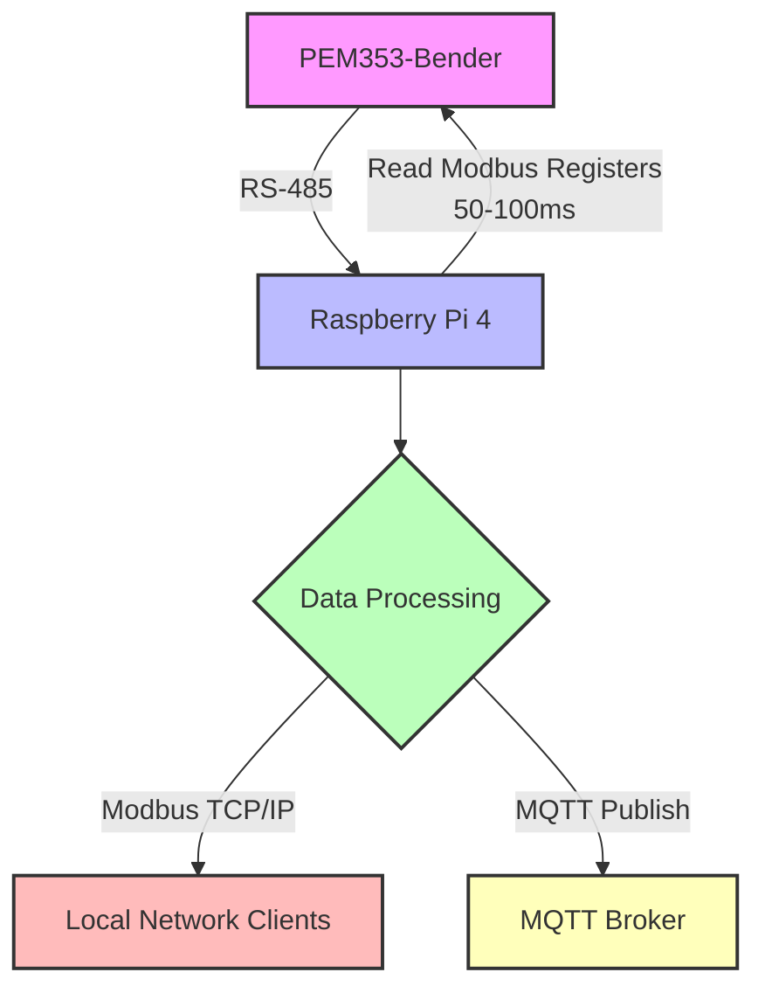

# Goal of project
Implement a networking layer on a pem353-bender using a raspberryPi 4.
1. Connect a raspberry pi to the pem353 over RS-485.
2. Read modbus [registers](#registers).
3. Make the data read available to be read from the raspberry pi over Modbus tcp/ip. 
4. Publish data read to a mqtt-broker. 
5. Reads from pem353 every 50-100 ms.
# Table of Contents

## Flowchart 

# pem353
## registers
**Reads following registers:**

- **0000-0005:**
  - 0000-0001: U1 (Voltage L1-N) – float
  - 0002-0003: U2 (Voltage L2-N) – float
  - 0004-0005: U3 (Voltage L3-N) – float
- **0016-0021:**
  - 0016-0017: P1 (Active Power L1) – float
  - 0018-0019: P2 (Active Power L2) – float
  - 0020-0021: P3 (Active Power L3) – float
- **0030-0031:**
  - 0030-0031: Total Active Energy (Wh) – float
- **0056-0057:**
  - 0056: Status Digital Inputs – UINT16
  - 0057: Status Digital Outputs – UINT16

# Project structure

## configs folder
Example of configs needed for this project

## ConfigManager
ConfigManager class to read and hold configs from json formated config files.

it uses [nlohmann::json](#nlohmann::json) for json parsing.

The configManager will for now only work with the objects used in this project like
- mqttPub
- modbusTCP
- modbusRTU

You can change the already existing keys but if you add key you need to recompile.

\* To improve this class or create a resusable library out of it you would need to make it more generic with templates?

## source code

## Headers

## Build tools

### cmake
cmake is used to build the project.

c++ version is set to 17.

c version is set to 11.
  
#### Toolchains
**cmake/toolchains/raspberryPi.cmake**

Toolchain file to be able to cross compile from host machine to rpi4 64bit.
### cross compiling

## Testing and debugging 

### Google test

## Deployment

## External libraries
- [Libmodbus](#Libmodbus)
- [spdlog](#spdlog)
- [nlohmann::json](#nlohmann::json)
- [Pahomqttcpp](#Pahomqttcpp)

### Libmodbus

### spdlog

### nlohmann::json
nlohmann::json header only library.

**Version** v3.12.0

embedded directly in my build system.

### Pahomqttcpp
