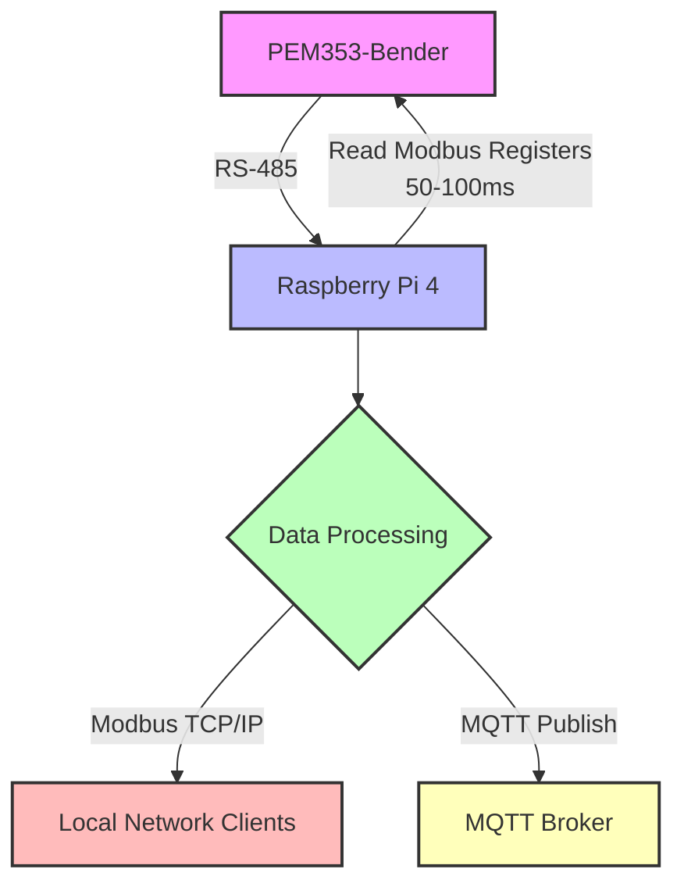

# Goal of project
Implement a networking layer on a pem353-bender using a raspberryPi 4.
1. Connect a raspberry pi to the pem353 over RS-485.
2. Read modbus [registers](#registers).
3. Make the data read available to be read from the raspberry pi over Modbus tcp/ip. 
4. Publish data read to a mqtt-broker. 
5. Reads from pem353 every 50-100 ms.
# Table of Contents
# Design and architecture 
## Hardware

### pem353-bender

### rasppberry pi 4
 - 1GB RAM
 - 64bit OS Lite
 - 
### raspberrypi rs-485 hat

## software
software components that will be built or used in this project
### pem353-bender service that runs on the raspberrypi
- modbusrtu client that reads data from the pem353
- publish reads to mqtt broker.
- runs a modbusTCP server and makes the data available to other devices.

### watchdog to monitor and manage the pem353-bender service

### deployment script
## Flowchart 



# pem353
## registers
**Reads following registers:**

- **0000-0005:**
  - 0000-0001: U1 (Voltage L1-N) – float
  - 0002-0003: U2 (Voltage L2-N) – float
  - 0004-0005: U3 (Voltage L3-N) – float
- **0016-0021:**
  - 0016-0017: P1 (Active Power L1) – float
  - 0018-0019: P2 (Active Power L2) – float
  - 0020-0021: P3 (Active Power L3) – float
- **0030-0031:**
  - 0030-0031: Total Active Energy (Wh) – float
- **0056-0057:**
  - 0056: Status Digital Inputs – UINT16
  - 0057: Status Digital Outputs – UINT16

# Project structure

## configs folder
Example of configs needed for this project

## ConfigManager
ConfigManager class to read and hold configs from json formated config files.
## external libraries 
- [nlohmann::json](#nlohmann::json) for json parsing.

This short snippet will instantiate a ConfigManager object and read the config from a JSON file.

It extracts and separates the Modbus and Mqtt configs to its own JSON objects.

With the help of the ConfigManager::getModbusRTUConfig() and ConfigManager::getMqttPubConfig() methods you can access the
configs as JSON objects.
```cpp
ConfigManager configs(filepath);
json modbusRTUConfig = configs.getModbusRTUConfig();
json mqttPubConfig = configs.getMqttPubConfig();
```

\* To improve this class or create a resusable library out of it you would need to make it more generic with templates and
interfaces?

## modbusRTU
this class is used to read data from a modbus device over RS-485. 
the constructor takes a ConfigManager object as parameter. and then initialises the modbusRTU object with the settings from the settings class
1. constructor initializes the modbusRTU object with the settings from the ConfigManager object.
2. connect() method connects to the modbusRTU device.
3. readRegisters() method reads the data from the modbusRTU device.
4. updatePemData() method updates the pemData member variable with the data read from the modbusRTU device.
and transforms 2 registers into a float value
## dataclasses
this directory contains all the dataclasses used in this project. these classes main purpose is to hold data read from the pem353. or settings for the communication classes

### mbRtuSettings 
this class holds the settings for the modbusRTU class
### external libraries
It uses the [Libmodbus](#Libmodbus) library
### Project classes the modbusRTU depends on
- ConfigManager
- 
  uses the getModbusRTUConfig() method to get the modbusRTU config from the ConfigManager object at construction.
- 
  a modbusRTU object then has full access to all the predetermined settings from the config file.
## source code


## Headers

## Build tools

### cmake
cmake is used to build the project.

c++ version is set to 17.

c version is set to 11.
  
#### Toolchains
**cmake/toolchains/raspberryPi.cmake**

Toolchain file to be able to cross compile from host machine to rpi4 64bit.
### cross compiling

## Testing and debugging 

### Google test

## Deployment


## External libraries
- [Libmodbus](#Libmodbus)
- [spdlog](#spdlog)
- [nlohmann::json](#nlohmann::json)
- [Pahomqttcpp](#Pahomqttcpp)


### Libmodbus

### spdlog

### nlohmann::json
nlohmann::json header only library.

**Version** v3.12.0

embedded directly in my build system.


### Pahomqttcpp
